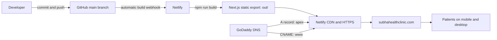

# Subha Health ENT Clinic

Production website for Subha Health ENT Clinic in Dindigul, Tamil Nadu. The site is bilingual (English and Tamil), mobile responsive, statically exported from Next.js, and automatically deployed to Netlify from GitHub.

## Production links

| Resource | URL |
| --- | --- |
| Website | [https://subhahealthclinic.com](https://subhahealthclinic.com) |
| GitHub repository | [pamayathevar/SubhaHealthClinic](https://github.com/pamayathevar/SubhaHealthClinic) |
| Netlify project | [subha-health-clinic](https://app.netlify.com/projects/subha-health-clinic) |
| Netlify fallback URL | [https://subha-health-clinic.netlify.app](https://subha-health-clinic.netlify.app) |

## System overview



The system has three separate owners:

- **GitHub** stores the source code and deployment history.
- **Netlify** builds and hosts the website, manages HTTPS, and redirects `www` to the primary domain.
- **GoDaddy** registers the domain and hosts its DNS records. GoDaddy does not host this website.

See [Operations and Deployment Runbook](docs/OPERATIONS.md) for the complete development, deployment, DNS, rollback, and recovery procedure.

## Technology

| Area | Implementation |
| --- | --- |
| Framework | Next.js 16 App Router |
| UI | React 19 + TypeScript |
| Styling | CSS in `app/globals.css` |
| Output | Static HTML/CSS/JavaScript in `out/` |
| Hosting | Netlify continuous deployment |
| DNS registrar/provider | GoDaddy |
| Languages | English and Tamil |
| Backend/database/authentication | None |

This is intentionally a static informational site. It has no sign-in, database, API server, patient portal, or form data storage.

## Prerequisites

- Node.js `22.13.1` or another compatible `>=22.13.0` release
- npm
- Git

## Local development

```bash
git clone https://github.com/pamayathevar/SubhaHealthClinic.git
cd SubhaHealthClinic
nvm use
npm ci
npm run dev
```

If Node Version Manager is not installed, use any Node release compatible with `>=22.13.0`; `.nvmrc` records the production version.

Open [http://localhost:3000](http://localhost:3000).

## Validate a change

Run the same quality checks expected before deployment:

```bash
npm run lint
npm test
```

`npm test` creates the static export and verifies the rendered homepage and required public assets. A successful production build is written to `out/`.

To preview the exact static output locally:

```bash
npm run build
python3 -m http.server 4173 -d out
```

Then open [http://localhost:4173](http://localhost:4173).

## Repository map

```text
app/
  layout.tsx              SEO metadata, canonical URL and social sharing data
  page.tsx                English/Tamil content and all homepage sections
  globals.css             Layout, theme and responsive/mobile styling
public/
  gallery/                Real clinic photographs
  services/               Service-card images
  subha-health-logo.png   Primary clinic logo
  og.png                  Social sharing image
tests/
  rendered-html.test.mjs  Static-export smoke tests
docs/
  CONTENT_GUIDE.md        Safe content, language and image editing guide
  OPERATIONS.md           Full deployment and production runbook
netlify.toml              Netlify build, publish, cache and security headers
next.config.ts            Static-export configuration
package.json              Dependencies and local commands
.nvmrc                    Node version used by Netlify
```

## Common changes

| Change | Primary file/location |
| --- | --- |
| English or Tamil wording | `content` object in `app/page.tsx` |
| Services | `services` object in `app/page.tsx` and `public/services/` |
| Conditions treated | `concerns` object in `app/page.tsx` |
| Gallery | `galleryImages` in `app/page.tsx` and `public/gallery/` |
| Phone, WhatsApp, email or address | `app/page.tsx` |
| Visual layout and mobile breakpoints | `app/globals.css` |
| Page title, description or social image | `app/layout.tsx` |
| Build command, publish directory or response headers | `netlify.toml` |

Read [Content and Design Guide](docs/CONTENT_GUIDE.md) before changing medical wording, Tamil content, clinic photos, or contact information.

## Deployment summary

The production branch is `main`.

```bash
git checkout main
git pull --ff-only
npm ci
npm run lint
npm test
git add <changed-files>
git commit -m "Describe the change"
git push origin main
```

Netlify automatically builds and publishes every successful push to `main`. There is no separate FTP upload, GoDaddy publish action, or manual copy to the server.

After pushing, verify:

1. The commit appears on GitHub.
2. The Netlify deploy for that commit is `Published`.
3. [https://subhahealthclinic.com](https://subhahealthclinic.com) contains the change.
4. [https://www.subhahealthclinic.com](https://www.subhahealthclinic.com) redirects to the primary domain.
5. English and Tamil views work on both desktop and mobile.

## Important production rules

- Do not commit passwords, access tokens, recovery codes, `.env` files, or patient information.
- Do not upload patient-identifiable photographs without documented permission.
- Keep both English and Tamil content current; do not perform literal word-for-word Tamil translation.
- Keep the site static unless a backend is intentionally designed and approved.
- Do not change GoDaddy nameservers or delete email-related DNS records during a website update.
- Do not point `www` back to `custom-domains.chatgpt.site`; production is hosted by Netlify.
- Prefer a small, reversible commit for each production change so rollback is straightforward.

## Detailed documentation

- [Operations and Deployment Runbook](docs/OPERATIONS.md)
- [Content and Design Guide](docs/CONTENT_GUIDE.md)

## Official platform references

- [Next.js static exports](https://nextjs.org/docs/app/guides/static-exports)
- [Netlify continuous deployment](https://docs.netlify.com/deploy/create-deploys/)
- [Netlify external DNS configuration](https://docs.netlify.com/manage/domains/configure-domains/configure-external-dns/)
- [GoDaddy: edit a CNAME record](https://www.godaddy.com/en-uk/help/edit-a-cname-record-19237)
