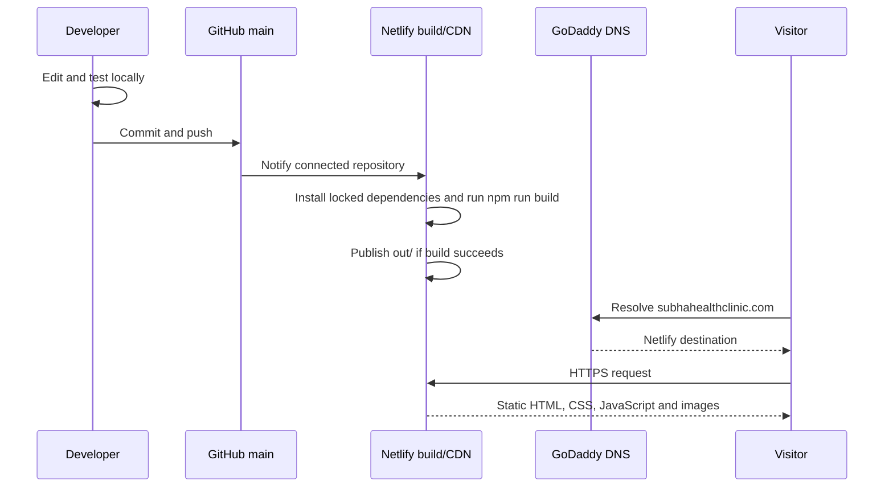

# Operations and Deployment Runbook

This document is the production handover for the Subha Health ENT Clinic website. It explains how source code becomes the live website, which provider owns each responsibility, how to deploy safely, and how to recover from common failures.

Last verified: **August 21, 2026**

## 1. Production inventory

| Item | Current value |
| --- | --- |
| GitHub repository | `https://github.com/pamayathevar/SubhaHealthClinic` |
| Production branch | `main` |
| Netlify project name | `subha-health-clinic` |
| Netlify project dashboard | `https://app.netlify.com/projects/subha-health-clinic` |
| Netlify fallback URL | `https://subha-health-clinic.netlify.app` |
| Primary production URL | `https://subhahealthclinic.com` |
| Alternate URL | `https://www.subhahealthclinic.com` |
| Domain registrar | GoDaddy |
| Authoritative DNS provider | GoDaddy DNS |
| HTTPS certificate manager | Netlify / Let’s Encrypt |
| Build command | `npm run build` |
| Publish directory | `out` |
| Node version in Netlify | `22.13.1` |
| Runtime backend | None; static site only |

The Netlify fallback URL is useful for separating a hosting problem from a DNS problem. If the fallback URL works but the custom domain does not, the build is healthy and the problem is in DNS or domain configuration.

## 2. Responsibility boundaries

| Provider | Owns | Does not own |
| --- | --- | --- |
| GitHub | Source, commits, branches, history and collaboration | Live hosting or DNS |
| Netlify | Builds, deploys, CDN, HTTPS certificates, primary-domain redirect | Domain registration or GoDaddy DNS records |
| GoDaddy | Domain registration, renewal, nameservers and DNS records | Website code or Netlify deploys |

Changing a website file never requires a GoDaddy action. Changing a DNS record never changes the GitHub source. A normal content or design deployment touches only GitHub; Netlify performs the rest automatically.

## 3. End-to-end request and deployment flow



The application uses `output: "export"` in `next.config.ts`. `next build` writes deployable static files to `out/`. There is no always-running Node server in production.

## 4. Access required for maintainers

A production maintainer should have their own named access to:

1. The GitHub repository.
2. The Netlify team/project.
3. The GoDaddy account or delegated domain access.

Do not share passwords, authenticator codes, recovery codes, personal access tokens, or browser session files through GitHub. Use each provider’s invitation/delegated-access feature. Enable two-factor authentication and retain recovery details in an owner-controlled password manager.

Access to GitHub and Netlify is enough for ordinary website work. GoDaddy access is required only for domain registration, DNS, or nameserver incidents.

## 5. Local environment setup

### First-time setup

```bash
git clone https://github.com/pamayathevar/SubhaHealthClinic.git
cd SubhaHealthClinic
git checkout main
npm ci
npm run dev
```

Open `http://localhost:3000`.

Use `npm ci`, not `npm install`, for a clean reproducible installation from `package-lock.json`. Use `npm install <package>` only when intentionally changing dependencies.

### Daily update before editing

```bash
git checkout main
git pull --ff-only
npm ci
```

For larger work, create a branch:

```bash
git switch -c feature/short-description
```

### Static production preview

```bash
npm run build
python3 -m http.server 4173 -d out
```

Open `http://localhost:4173`. This serves the same static directory Netlify publishes.

`npm run start` is not the production path for this repository. The site is configured as a static export; use `npm run dev` for development or serve `out/` after a build.

## 6. Required validation

Run before every production push:

```bash
npm run lint
npm test
```

The checks cover:

- ESLint and React rules.
- TypeScript compilation through the Next.js build.
- Successful static export.
- Expected metadata and core English/Tamil content.
- Presence of required logo, service and gallery assets.

Also perform a visual check when changing layout, images or language:

- Desktop width.
- Mobile width.
- English mode.
- Tamil mode.
- Phone and WhatsApp links.
- Map and directions link.
- Keyboard focus and readable contrast for interactive elements.

## 7. Standard release procedure

### Recommended GitHub workflow

1. Pull the latest `main`.
2. Make one focused change.
3. Run lint and tests.
4. Review `git diff` and confirm no credentials or unrelated files are present.
5. Commit with a clear imperative message.
6. Push to GitHub.
7. Confirm the matching commit is published in Netlify.
8. Verify the live domain.

Example:

```bash
git checkout main
git pull --ff-only
npm ci

# Edit files

npm run lint
npm test
git diff --check
git status --short
git add app/page.tsx app/globals.css public/gallery tests/rendered-html.test.mjs
git commit -m "Update clinic gallery"
git push origin main
```

### What happens after `git push`

Netlify continuous deployment is connected to the GitHub repository. A push to `main` starts a production deploy automatically:

1. Netlify checks out the commit.
2. Netlify uses Node `22.13.1` from `netlify.toml`.
3. Netlify installs dependencies from `package-lock.json` and runs `npm run build`.
4. Next.js writes the static export to `out/`.
5. Netlify publishes `out/` only if the build succeeds.
6. The custom domain continues to point at the newly published production deploy.

There is no FTP, cPanel upload, GoDaddy Website Builder publish, manual ZIP upload, or separate server restart.

### Verify the deployment

Open:

`https://app.netlify.com/projects/subha-health-clinic/deploys`

Confirm:

- The top production deploy references the commit just pushed.
- Its state is `Published`, not `Building`, `Failed`, or `Canceled`.
- The commit message is the expected one.

Then verify with a browser and optionally the terminal:

```bash
curl -I https://subhahealthclinic.com/
curl -I https://www.subhahealthclinic.com/
```

Expected behavior:

- The apex domain returns the current site.
- `www` returns a Netlify redirect to `https://subhahealthclinic.com/`.
- Both use HTTPS with no certificate warning.

## 8. Netlify configuration

The source-controlled configuration is `netlify.toml`:

```toml
[build]
  command = "npm run build"
  publish = "out"

[build.environment]
  NODE_VERSION = "22.13.1"
  NEXT_TELEMETRY_DISABLED = "1"
```

It also defines response security headers and cache policies.

### Production domains in Netlify

Current Netlify domain configuration:

| Domain | Role |
| --- | --- |
| `subhahealthclinic.com` | Primary domain |
| `www.subhahealthclinic.com` | Redirects automatically to primary |
| `subha-health-clinic.netlify.app` | Netlify fallback domain |

Netlify currently provisions one Let’s Encrypt certificate covering both custom hostnames.

### GitHub connection

The Netlify GitHub App must retain access to `pamayathevar/SubhaHealthClinic`. If pushes stop creating deploys:

1. Open Netlify **Project configuration → Build & deploy → Continuous deployment**.
2. Confirm the repository and branch are correct.
3. In GitHub, check **Settings → Applications → Installed GitHub Apps → Netlify**.
4. Confirm the app can access this repository.
5. Re-link the repository only if the existing connection is broken.

Do not create a second Netlify project for an ordinary deployment problem. Repair the existing project so the custom domain, certificate and deploy history remain attached.

### Build settings precedence

Keep build configuration in `netlify.toml` so it is versioned with the repository. If the Netlify UI differs, the repository configuration should be treated as the expected source of truth. After changing build settings, test locally and document the reason in the commit.

## 9. GoDaddy DNS and domain configuration

GoDaddy is the registrar and external DNS provider. The nameservers remain GoDaddy’s nameservers:

- `ns69.domaincontrol.com`
- `ns70.domaincontrol.com`

Do not replace the nameservers during a routine website update.

### Critical website records

| Type | Name | Data | TTL | Purpose |
| --- | --- | --- | --- | --- |
| `A` | `@` | `75.2.60.5` | 1 hour | Routes the apex domain to Netlify |
| `CNAME` | `www` | `subha-health-clinic.netlify.app` | 1 hour | Routes `www` to Netlify |

These values were verified against the live production configuration on August 21, 2026. Before changing them in the future, compare them with the instructions shown in Netlify **Domain management** because hosting providers can update recommended targets.

### Records that must not be casually deleted

The DNS zone also contains records used for domain ownership, email, DKIM, SPF, DMARC, cPanel/hosting aliases and other connected services. They do not all belong to the website.

Never bulk-delete the zone. In particular, preserve:

- GoDaddy default `NS` and `SOA` records.
- `MX` records.
- Email authentication records such as `_dmarc`, SPF and `*_domainkey`.
- Any ownership-verification record still used by an active service.

When changing the website destination, edit only the exact `@` website record or the exact `www` CNAME after confirming the target in Netlify.

### DNS change procedure

1. Open GoDaddy Domain Portfolio.
2. Select `subhahealthclinic.com`.
3. Open **DNS**.
4. Locate the exact record by both type and name.
5. Record its current value for rollback.
6. Edit only the intended field.
7. Use a 1-hour TTL unless there is a documented reason to choose otherwise.
8. Save and complete GoDaddy identity verification if requested.
9. Verify the authoritative and public DNS responses.

```bash
dig @ns69.domaincontrol.com subhahealthclinic.com A +short
dig @ns69.domaincontrol.com www.subhahealthclinic.com CNAME +short
dig @1.1.1.1 subhahealthclinic.com A +short
dig @1.1.1.1 www.subhahealthclinic.com CNAME +short
dig @8.8.8.8 www.subhahealthclinic.com CNAME +short
```

Expected values:

```text
75.2.60.5
subha-health-clinic.netlify.app.
```

DNS caches may continue to return a previous value until its old TTL expires. GoDaddy states that many changes appear within an hour but global propagation can take longer. Do not repeatedly create duplicate records while waiting.

### Prohibited old target

`custom-domains.chatgpt.site` was part of the previous hosting setup and is no longer the production destination. Do not point `www` to it. If one hostname shows an old site while the other shows the current Netlify site, compare both DNS records immediately.

## 10. HTTPS and redirects

Netlify manages the Let’s Encrypt certificate. The current certificate covers:

- `subhahealthclinic.com`
- `www.subhahealthclinic.com`

The apex domain is primary. Netlify redirects `www` to the apex domain.

If HTTPS is pending or broken:

1. Confirm both DNS records resolve to Netlify.
2. Open Netlify **Domain management → HTTPS**.
3. Allow DNS propagation time.
4. Use **Renew certificate** only after DNS is correct.
5. Do not upload a custom certificate unless there is an explicit operational requirement.

## 11. Cache behavior

The site uses versioned Next.js static assets. `netlify.toml` applies:

- Long immutable caching to `/_next/static/*`.
- Revalidation/no-store behavior to the homepage HTML.

A new build generates new hashed JavaScript and CSS asset names, so normal deploys do not require users to clear their browser cache.

If one device shows an old site, identify whether the problem is HTTP cache or DNS:

```bash
curl -I https://subhahealthclinic.com/
curl -I https://www.subhahealthclinic.com/
dig @1.1.1.1 www.subhahealthclinic.com CNAME +short
```

- If apex and `www` reach different providers, it is DNS.
- If DNS is correct but a single browser is stale, try a private tab, close/reopen the browser, or switch network/airplane mode.
- A query parameter such as `?v=<commit>` can bypass a stale document cache for testing, but it cannot bypass incorrect DNS.

## 12. Rollback

### Preferred: revert the Git commit

This keeps GitHub and production aligned:

```bash
git checkout main
git pull --ff-only
git revert <bad-commit-sha>
npm run lint
npm test
git push origin main
```

Netlify deploys the revert commit automatically.

### Emergency: publish a previous Netlify deploy

Use this only when production must be restored before a code revert can be prepared:

1. Open Netlify **Deploys**.
2. Select the last known-good published deploy.
3. Choose **Publish deploy** or the equivalent rollback action.
4. Verify production immediately.
5. Revert or fix GitHub afterward.

An emergency Netlify rollback does not change the `main` branch. The next push can overwrite it, so follow up with a Git revert or corrective commit.

### DNS rollback

Change DNS only when the incident is actually a DNS/hosting migration problem. Restore the recorded previous value for the exact affected record. Never use a DNS rollback to fix a broken page component or failed Netlify build.

## 13. Troubleshooting matrix

| Symptom | Likely cause | Checks | Resolution |
| --- | --- | --- | --- |
| Push succeeded but live site did not change | Netlify build pending/failed or wrong commit | Netlify Deploys, commit SHA | Read build log, reproduce locally, fix and push |
| Apex is current but `www` is old | Wrong/stale `www` CNAME | `dig www... CNAME`, compare response servers | Set `www` to Netlify target and wait for TTL |
| Netlify fallback works but custom domain fails | DNS or certificate issue | `dig`, Netlify Domain management | Repair DNS, then renew/wait for TLS |
| Images work locally but not on Netlify | Missing commit, wrong case, asset absent from `public` | Git status, deploy files, test assets | Commit asset; match filename case exactly |
| Tamil text is English on first load | Language preference/locale behavior | Browser language and local storage | Select Tamil; inspect `subha-language` logic |
| Only one phone shows old content | Device/carrier DNS or browser cache | Compare private tab and another network | Wait for TTL, airplane mode, reopen browser |
| `npm test` fails on an expected phrase/image | Test still references old content/asset | `tests/rendered-html.test.mjs` | Update implementation and test together |
| Netlify never starts after push | GitHub App/repository connection broken | Netlify continuous deployment settings | Restore app permission or re-link repo |
| Email stops after DNS work | Mail DNS record changed/deleted | GoDaddy activity log and mail records | Restore MX/SPF/DKIM/DMARC; do not alter web records |
| Certificate warning | DNS does not point to Netlify or certificate pending | Both hostnames, Netlify HTTPS panel | Correct DNS, allow propagation, renew certificate |

## 14. Disaster recovery

### Rebuild the website from GitHub

```bash
git clone https://github.com/pamayathevar/SubhaHealthClinic.git
cd SubhaHealthClinic
npm ci
npm run lint
npm test
```

Everything needed for the static site is versioned except provider credentials.

### Re-create hosting if the Netlify project is lost

1. Sign in to Netlify.
2. Import an existing project from GitHub.
3. Select `pamayathevar/SubhaHealthClinic`.
4. Use branch `main`.
5. Confirm build command `npm run build` and publish directory `out`.
6. Confirm Node `22.13.1` or a compatible supported version.
7. Deploy and test the new `.netlify.app` URL.
8. Add `subhahealthclinic.com` as the production domain.
9. Add/confirm the `www` alias.
10. Use the DNS targets shown by the new project. Do not assume the old project target if Netlify displays something different.
11. Update only the relevant GoDaddy `A` and `CNAME` records.
12. Wait for DNS and HTTPS, then verify both hostnames.

### If the GitHub repository becomes unavailable

Any current clone contains the Git history. Create a replacement private/public repository as appropriate, push all branches/tags, and reconnect Netlify. Confirm ownership and visibility before changing production automation.

### Domain continuity

- Keep GoDaddy domain auto-renew enabled with a valid payment method.
- Keep the registrant email current.
- Retain two-factor recovery methods.
- Do not allow the domain to expire; code and hosting can be healthy while an expired domain makes the site unreachable.

## 15. Security, privacy and medical-content boundaries

- The site stores no patient records and must not be used to collect medical details.
- Phone and WhatsApp links open external communication channels; they do not write data to this repository.
- Do not add analytics, forms, cookies, authentication or third-party scripts without reviewing privacy and consent requirements.
- Never commit patient names, records, prescriptions, appointment details or identifiable health information.
- Use clinic photographs only with documented permission from the clinic and visible individuals where required.
- Keep the website disclaimer that general information does not replace medical advice.
- Medical procedure descriptions must be reviewed by the clinic before publication.

## 16. Change checklist

### Before pushing

- [ ] Latest `main` pulled.
- [ ] English and Tamil content updated together.
- [ ] No credentials or patient data added.
- [ ] Images are approved, optimized and correctly named.
- [ ] `npm run lint` passes.
- [ ] `npm test` passes.
- [ ] Desktop and mobile visually reviewed.
- [ ] `git diff` contains only intended files.

### After pushing

- [ ] GitHub shows the expected commit on `main`.
- [ ] Matching Netlify deploy is `Published`.
- [ ] Apex domain shows the change.
- [ ] `www` redirects to the apex domain.
- [ ] English and Tamil modes work.
- [ ] Contact, WhatsApp, map and email links work.
- [ ] No HTTPS warning or missing assets.

## 17. Official references

- [Next.js static export guide](https://nextjs.org/docs/app/guides/static-exports)
- [Netlify: create deploys and Git continuous deployment](https://docs.netlify.com/deploy/create-deploys/)
- [Netlify build configuration](https://docs.netlify.com/build/configure-builds/overview/)
- [Netlify external DNS configuration](https://docs.netlify.com/manage/domains/configure-domains/configure-external-dns/)
- [Netlify apex and www domain behavior](https://docs.netlify.com/domains/manage-domains/manage-multiple-domains/)
- [GoDaddy: edit a CNAME record](https://www.godaddy.com/en-uk/help/edit-a-cname-record-19237)
